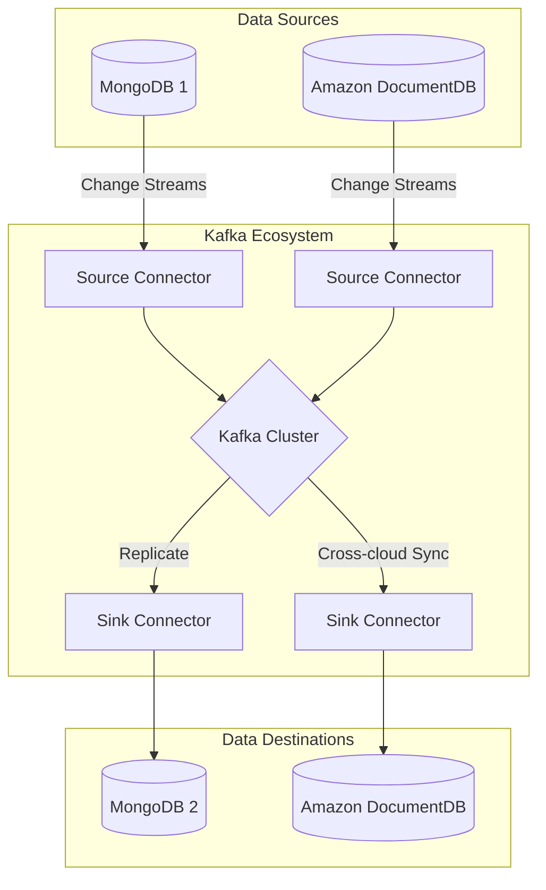

# Kafka Connector PoC for MongoDB and Amazon DocumentDB

This repository demonstrates a Proof of Concept (PoC) for streaming data between MongoDB and Amazon DocumentDB using Kafka Connect. It includes both source and sink connectors with automated setup via Taskfile.

## Features

- 🚀 Seed data generation for MongoDB & DocumentDB
- 🔄 Bi-directional data streaming between:
  - Local MongoDB instances
  - Local MongoDB and AWS DocDB
- 📦 Dockerized environment with:
  - Kafka ecosystem (Broker, Connect, Schema Registry)
  - MongoDB containers
  - Data seeding service
- ⚡ Taskfile automation for:
  - Connector setup
  - Data seeding
  - Database connections

## Architecture Overview



## Prerequisites

- Docker 20.10+
- Docker Compose 2.20+
- Taskfile ([installation guide](https://taskfile.dev/installation/))
- AWS DocumentDB:
  - Connection string
  - CA certificate (`global-bundle.pem`)
- `.env` file with required credentials—copy `.env.example` to `.env` and set the right values

## 🚀 Getting Started

### 1. Clone Repository
```bash
git clone git@github.com:hudl/cloud-alchemists-kafka-poc.git
cd kafka-mongodb-poc
```

### 2. Environment Setup
```bash
cp .env.example .env
# Edit .env with your credentials
```

Example `.env`:
```
DOCDB_HOST=t-some-host.us-east-1.docdb.amazonaws.com
DOCDB_PASSWORD=<docdb_password>
DOCDB_CONNECTION_STRING=mongodb://<docdb_username>:<docdb_password>@some-host.us-east-1.docdb.amazonaws.com:27018/?tls=true&replicaSet=rs0&readPreference=secondaryPreferred&retryWrites=false
```

### 3. Start Services
```bash
docker-compose up -d --build
```

Wait 2-3 minutes for services to initialize.

### 📋 Taskfile Commands
```bash
task mongo_1:seed -- 400    # Seed MongoDB with 400 documents
task docdb:seed -- 400    # Seed DocumentDB with 400 documents
```
You can change the number of records if you want.

### Connector Management
```
# Source Connectors
task kafka:mongo_1:source  # Create MongoDB source connector
task kafka:docdb:source    # Create DocumentDB source connector

# Sink Connectors
task kafka:mongo-2:sink-mongo   # MongoDB->MongoDB replication
task kafka:docdb:sink-mongo-1   # DocDB->MongoDB pipeline
task kafka:mongo-2:sink-docdb   # MongoDB->DocDB replication
```

### Database Access
```bash
task docdb:connect  # Connect to DocumentDB via mongosh
```

### 🐳 Docker Services Overview
| Service	| Ports	| Description |
| --- | --- | --- | 
Kafka Broker |	9092 |	Apache Kafka message broker
Schema Registry |	8081 |	Avro schema management
Kafka Connect |	8083 |	Connector management API
Control Center |	9021 |	Web UI for monitoring
MongoDB (mongo_1) |	27017 |	Primary MongoDB instance
MongoDB (mongo_2) |	- |	Secondary MongoDB for replication
KSQLDB Server |	8088 |	Stream processing engine

### 🔍 Testing the Pipeline

#### 1. Verify Connectors
```bash
# list the kafka connectors
curl -sS http://localhost:8083/connectors | jq

# check the connector status
curl -sS localhost:8083/connectors/<connector name>/status
```

#### 2. Monitor Data Flow
Access Control Center:
http://localhost:9021
Check:

- Connector statuses
- Topic messages (mongo_1.demo.users, docdb.demo.users)
- Consumer lag metrics

#### 3. Inspect Databases
##### MongoDB
```bash
docker exec -it mongo_1 mongosh demo --eval "db.getCollectionNames()"
```

##### DocumentDB:
```bash
task docdb:connect
> use demo
> db.imported_users.countDocuments()
```

### 📁 Project Structure
```
.
├── lib/
│   ├── kafka-connect/    # Custom Kafka Connect image
│   ├── mongo/            # Replica set initialization
│   └── py-seed/          # Data generation application
├── docker-compose.yml    # Service definitions
├── Taskfile.yaml         # Automation commands
└── global-bundle.pem     # DocumentDB CA cert
```

### 🚨 Troubleshooting
#### Common Issues:
##### 1. Connectors failing to start
 - Check Connect logs:
```bash
docker logs connect -f
```
- Verify network connectivity between containers

##### 2. DocumentDB connection issues
- Make sure that the VPN is connected
- Ensure global-bundle.pem exists in root
- Verify connection string format:
```ini
mongodb://<user>:<password>@<endpoint>:27017/?tls=true&replicaSet=rs0
```

##### 3. Data not appearing in sinks
- Check topic subscriptions:
```
docker exec -it kcat kafkacat -b broker:9092 -L
```


