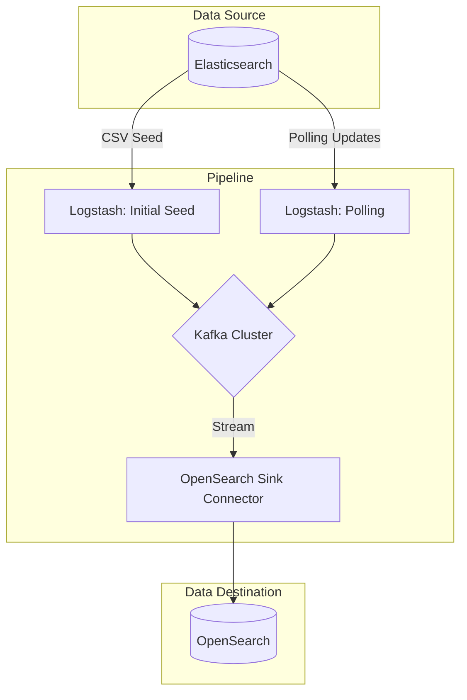

# Elasticsearch to OpenSearch PoC via Kafka and Logstash


## Overview

This directory demonstrates a Proof of Concept (PoC) for streaming data from Elasticsearch to OpenSearch using Logstash and Kafka Connect. It includes seeding data into Elasticsearch, streaming it to Kafka via Logstash, and sinking it into OpenSearch, with automation provided by Taskfile.

## Architecture Overview



## Features

- 🚀 Seed CSV data into Elasticsearch using Logstash
- 🔄 Data streaming pipeline:
    - Elasticsearch → Kafka (via Logstash)
    - Kafka → OpenSearch (via Kafka OpenSearch Sink Connector)
- 📦 Dockerized environment with:
    - Elasticsearch
    - Kafka ecosystem (Broker, Connect)
    - Logstash services
    - OpenSearch
- ⚡ Taskfile automation for:
    - Service orchestration
    - Kafka topic creation
    - Docker network management

## Prerequisites

- Docker 20.10+
- Docker Compose 2.20+
- Taskfile ([installation guide](https://taskfile.dev/installation/))
- Optional: .env file for custom configurations—copy .env.example to .env if needed

## 🚀 Getting Started

### 1. Clone Repository
```bash
git clone git@github.com:hudl/cloud-alchemists-kafka-poc.git
cd ./cloud-alchemists-kafka-poc/elasticsearch
```


### 2. Environment Setup

```bash
# Optional: Copy and edit .env if custom configurations are needed
cp .env.example .env
```

Example .env (optional):

```bash
ELASTICSEARCH_HOST=localhost:9200
KAFKA_BOOTSTRAP_SERVERS=broker:9092
OPENSEARCH_HOST=localhost:9200
```

### 3. Start Services

```bash
task up
```

Wait 2-3 minutes for services to initialize. This command:

- Creates a Docker network (elasticsearch-poc)
- Starts all services defined in docker-compose.yml
- Creates the Kafka topic (liquorsales)

## 📋 Taskfile Commands

### Service Management

```bash
task up          # Start all services
task down        # Stop and remove all services
task docker:elasticsearch  # Start Elasticsearch and seeding Logstash
task docker:kafka          # Start Kafka and polling Logstash
```

### Kafka Topic Management

The liquorsales topic is automatically created during task up. To recreate it manually:

```bash
task kafka:create-topic
```

## 🐳 Docker Services Overview

| Service            | Ports | Description                       |
| ------------------ | ----- | --------------------------------- |
| Elasticsearch      | 9200  | Source Elasticsearch instance     |
| Logstash (Seed)    | -     | Seeds CSV data into Elasticsearch |
| Logstash (Polling) | -     | Polls Elasticsearch to Kafka      |
| Kafka Broker       | 9092  | Apache Kafka message broker       |
| Kafka Connect      | 8083  | Connector management API          |
| OpenSearch         | 9200  | Target OpenSearch instance        |

## 🔍 Testing the Pipeline

### 1. Verify Data in Elasticsearch

Check if the CSV data was seeded:

```bash
curl -X GET "localhost:9200/liquor_sales/_search?pretty"
```
### 2. Verify Kafka Topic

List topics and inspect messages:

```bash
docker exec -it broker kafka-topics --list --bootstrap-server broker:9092
docker exec -it broker kafka-console-consumer --bootstrap-server broker:9092 --topic liquorsales --from-beginning
```

### 3. Configure OpenSearch Sink Connector

Manually create the connector (example configuration):

```bash
curl -X POST -H "Content-Type: application/json" --data '{
  "name": "opensearch-sink",
  "config": {
    "connector.class": "io.confluent.connect.opensearch.OpenSearchSinkConnector",
    "tasks.max": "1",
    "topics": "liquorsales",
    "connection.url": "http://opensearch:9200",
    "type.name": "_doc",
    "key.ignore": "true",
    "schema.ignore": "true"
  }
}' http://localhost:8083/connectors
```

Check connector status:

```bash
curl -sS http://localhost:8083/connectors/opensearch-sink/status | jq
```

### 4. Verify Data in OpenSearch

Query the OpenSearch index:

```bash
curl -X GET "localhost:9200/liquorsales/_search?pretty"
```

## 📁 Project Structure

```text
.
├── Taskfile.yaml            # Automation commands
├── docker-compose.yml       # Main service definitions
├── kafka-include.yaml       # Kafka-specific configurations
├── logstash-elasticsearch/  # Elasticsearch seeding setup
│   ├── data.sample.csv      # Sample CSV data
│   ├── docker-compose.yaml  # Elasticsearch and Logstash config
│   └── logstash.conf        # Logstash config for seeding
└── logstash-kafka/          # Kafka polling setup
    ├── docker-compose.yaml  # Kafka and polling Logstash config
    ├── logstash.conf        # Initial Kafka sync config
    └── logstash.polling.conf # Polling config for updates
```

## 🚨 Troubleshooting

### Common Issues

#### 1. Logstash Fails to Seed Data

- Check logs:

```bash
docker logs -f logstash-elasticsearch
```

- Verify data.sample.csv exists and is readable.

#### 2. Kafka Topic Not Receiving Data

- Check polling Logstash logs:

```bash
docker logs -f logstash-elasticsearch
```

#### 3. OpenSearch Sink Not Working

- Verify connector logs:

```bash
`docker logs connect -f`
```

- Ensure the OpenSearch host is reachable from Kafka Connect.

## FAQ

### Can this handle real-time updates from Elasticsearch?

Yes, the polling Logstash configuration (logstash.polling.conf) periodically queries Elasticsearch for updates. However, it relies on a timestamp field (e.g., last_updated) to detect changes. Elasticsearch lacks a native change data capture (CDC) mechanism. Polling with timestamps is a workaround

### What’s the impact on the source Elasticsearch instance?

Polling increases CPU and memory usage on Elasticsearch, especially with frequent queries or large indices. Tune the polling interval (e.g., every 5 minutes) and query scope to minimize impact.

### How scalable is this setup?

- **Logstash**: Scales vertically; add more instances for parallel processing.
- **Kafka**: Horizontally scalable with more partitions and brokers.
- **OpenSearch**: Scales with cluster size. Adjust connector tasks.max for parallelism.
